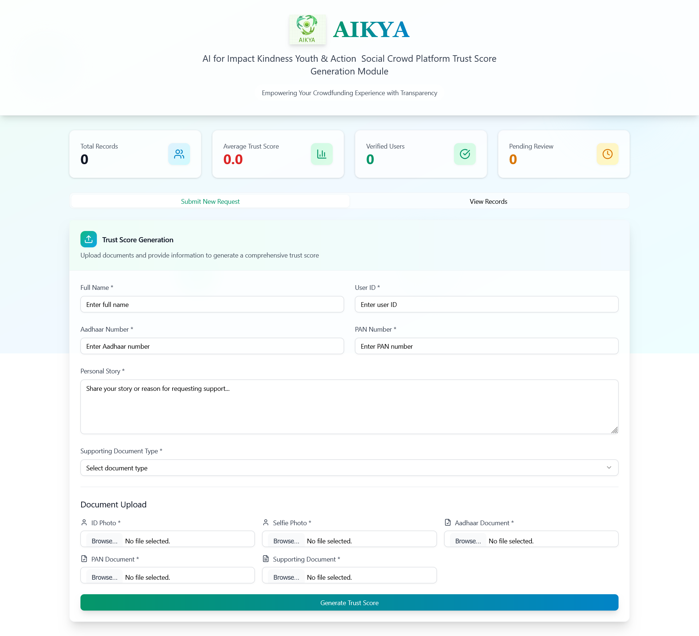

# AIKYA Trust Score Module

 

---

## Overview


Hi! I'm Sattwik Sarkar, and this is my personal project: the AIKYA Trust Score Module — a full-stack trust evaluation platform built with a Python/Flask backend and a modern Next.js/React frontend. I created this project to learn, experiment, and showcase how digital trust can be measured using real-world signals and advanced verification techniques.

## Why I Built This

I wanted to dive deep into the world of digital identity and trust, and understand how multiple factors — like facial recognition, document verification, story analysis, emotion detection, and engagement scoring — can be combined to create a fair and transparent trust metric. Building this project helped me learn about authentication, database design, NLP, and integrating machine learning models into production APIs and user interfaces.

Whether you're a developer, researcher, or innovator, you'll find AIKYA easy to extend, audit, and deploy for your own use cases. The backend is modular and robust, while the frontend is designed for a seamless user experience.

Ready to explore how trust can be built with confidence? Dive in and see what AIKYA can do!

---

## Table of Contents

- [Project Structure](#project-structure)
- [Technologies Used](#technologies-used)
- [Setup Instructions](#setup-instructions)
  - [Backend](#backend)
  - [Frontend](#frontend)
- [API Endpoints](#api-endpoints)
- [Screenshots](#screenshots)
- [License](#license)

---

## Project Structure

```
Trust_Score_Modules/
│
├── Backend/
│   ├── app.py                # Main Flask API
│   ├── config.py             # Configuration settings
│   ├── gradio_app.py         # Gradio UI for quick testing
│   ├── init_db.py            # Database initialization
│   ├── models.py             # SQLAlchemy models
│   ├── requirements.txt      # Python dependencies
│   └── verifier/
│       ├── __init__.py
│       ├── admin_override.py
│       ├── emotion_detector.py
│       ├── engagement_score.py
│       ├── face_verifier.py
│       ├── ocr_verifier.py
│       ├── story_nlp.py
│       └── trust_score.py
│
├── Frontend/
│   └── aikyafr/              # Main Next.js frontend
│       ├── app/              # App entry and global styles
│       ├── components/       # UI components
│       ├── lib/              # Utility functions
│       ├── public/           # Static assets (images, etc.)
│       ├── package.json      # Frontend dependencies
│       └── ...               # Other config and setup files
│
├── docs/                     # Documentation and images
│
├── LICENSE
└── README.md
```

---

## Technologies Used

### Backend
- **Python 3.11+**
- **Flask** (API framework)
- **Flask-SQLAlchemy** (ORM)
- **DeepFace** (Face recognition)
- **Pytesseract** (OCR)
- **Transformers** (NLP, sentiment analysis)
- **OpenCV** (Image processing)
- **Pillow** (Image handling)
- **Numpy, Pandas, Scikit-learn** (Data processing)
- **Matplotlib** (Optional, for visualizations)

### Frontend
- **Next.js** (React framework)
- **Radix UI** (UI components)
- **Tailwind CSS** (Styling)
- **TypeScript** (Type safety)
- **Other modern React libraries** (see `package.json`)

---

## Setup Instructions

### Backend

1. **Create and activate a Python environment:**
	```sh
	python -m venv venv
	.\venv\Scripts\activate   # On Windows
	```

2. **Install dependencies:**
	```sh
	pip install -r Backend/requirements.txt
	```

3. **Initialize the database:**
	```sh
	python Backend/init_db.py
	```

4. **Run the Flask API:**
	```sh
	python Backend/app.py
	```
	The API will be available at `http://127.0.0.1:5000/`

5. *(Optional)* **Run the Gradio UI for quick testing:**
	```sh
	python Backend/gradio_app.py
	```

---

### Frontend (aikyafr)

1. **Navigate to the frontend folder:**
	```sh
	cd Frontend/aikyafr
	```

2. **Install dependencies:**
	```sh
	npm install
	```

3. **Start the development server:**
	```sh
	npm run dev
	```
	The frontend will be available at `http://localhost:3000/`

---

## API Endpoints

- `GET /`  
  Returns a welcome message and available endpoints.

- `POST /submit`  
  Accepts user data and files, runs all verification modules, and returns a trust score.

- `GET /records`  
  Returns all trust score records from the database.

---

## Screenshots

<!-- Add your screenshots below. Replace the paths with your actual images. -->




---

## License

This project is licensed under the MIT License. See [LICENSE](./LICENSE) for details.

---


# Author

**Sattwik Sarkar**  
GitHub: [Sattwik999](https://github.com/Sattwik999)  
LinkedIn: [sattwik-sarkar999](https://www.linkedin.com/in/sattwik-sarkar999)  
Email: sattwiksarkar999@gmail.com

Feel free to connect for collaboration, questions, or feedback!

---

## Contact & Contribution

For questions, suggestions, or contributions, please open an issue or submit a pull request on [GitHub](https://github.com/Sattwik999/Trust_Score_Module).

---
# Trust_Score_Module
Trust Score Module for the Software Engineering Project AIKYA
